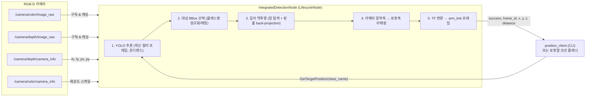

# ROS 2 + YOLO 기반 로봇팔 대상 3D 객체 인식/위치추정 시스템

> RGB-D 카메라와 YOLO를 결합해, **"이 물체가 어디 있지?"라는 의미론적 질의(class name) 한 번으로 로봇팔 좌표계 기준의 3D 위치(x, y, z)를 돌려주는** 온디맨드 인식 서비스. 나무 큐브(wooden-cube) pick-and-place를 목표 태스크로 구현했습니다.


Author: **정승준 (SEUNG JOON JEONG)** · GitHub [@Roka-jsj](https://github.com/Roka-jsj)
Base framework: [mgonzs13/yolo_ros](https://github.com/mgonzs13/yolo_ros) (Miguel Á. González-Santamarta) — fork, GPL-3.0

---

## 1. 프로젝트 개요

로봇팔이 물체를 집으려면 "무엇을 집을지"(인식)와 "그 물체가 로봇 좌표계에서 어디인지"(3D 위치추정)를 함께 알아야 합니다. 일반적인 실시간 검출 파이프라인은 매 프레임마다 결과를 쏟아내지만, 매니퓰레이터 입장에서 필요한 것은 **"집으려는 순간, 특정 대상 하나의 정확한 3D 좌표"** 입니다.

이 프로젝트는 그 간극을 **서비스 지향(service-oriented) 인식 노드**로 메웁니다.

- **입력**: RGB-D 카메라 스트림 (컬러 이미지 + 정렬된 깊이 이미지 + 카메라 내부 파라미터)
- **질의**: 클라이언트가 대상 클래스명(예: `wooden_cube`)을 담아 `GetTargetPosition` 서비스를 호출
- **처리**: 요청이 들어온 순간에만 최신 컬러 프레임에 YOLO 추론을 1회 수행 → 대상 검출 → 깊이 역투영으로 3D 좌표 산출 → 카메라 축을 로봇 축으로 리매핑 → TF로 로봇팔 프레임(`arm_link`)으로 변환
- **출력**: `success`, `frame_id`, `x`, `y`, `z`, `distance`

즉, 상위 모션 플래너는 별도의 검출 메시지 파싱 없이 **"나무 큐브 좌표 줘"라는 한 번의 요청으로 로봇팔 좌표계의 metric 3D 포인트**를 받아 곧바로 pick-and-place에 사용할 수 있습니다. 이것이 인식-매니퓰레이션을 잇는 이 프로젝트의 핵심 계약(contract)입니다.

---

## 2. 핵심 기여 / 직접 구현한 부분

이 저장소는 검증된 오픈소스 YOLO-ROS 프레임워크(mgonzs13/yolo_ros)를 **기반**으로 하되, 그 위에 **로봇팔 파지를 위한 서비스형 3D 위치추정 파이프라인**을 직접 설계·구현한 것이 핵심 가치입니다. 프레임워크 전체를 원작이라 주장하지 않으며, 저자의 기여와 상속받은 부분을 아래와 같이 명확히 구분합니다.

### 직접 구현 (저자 고유 기여)

- **`obj_detection.py` — `IntegratedDetectionNode` (센터피스)**
  2D 검출과 3D 위치추정을 **단일 서비스 뒤로 융합**한 ROS 2 관리형 라이프사이클 노드(node name: `integrated_detection_node`). 상시 동작하는 검출기가 아니라, 클라이언트 요청 시에만 최신 컬러 프레임에 YOLO 순전파를 1회 수행하는 **온디맨드 방식**.
  - GPU 모델을 `ACTIVE` 상태에서만 로드하고 `deactivate` 시 `torch.cuda.empty_cache()`로 VRAM을 명시적으로 반환하는 **정석적인 라이프사이클 설계**
  - 깊이 홀/NaN에 강인한 **확장 링 탐색(depth hole search)**, **핀홀 역투영**, **카메라→로봇 축 리매핑**, **직접 구현한 쿼터니언-벡터 회전 기반 TF 변환**까지 3D 기하 전 과정을 자체 구현
  - 컬러/깊이 해상도 불일치 보정, 클래스명 정규화 및 부분일치 매칭, 정렬/회전(OBB) 박스 모두 지원
- **`position_client.py` — CLI 클라이언트**
  `argv`의 클래스명으로 `/yolo/get_target_position`를 호출해 x, y, z, distance, frame을 출력하는 얇은 클라이언트 노드. `ros2 run yolo_ros position <class_name>` 엔트리포인트.
- **`GetTargetPosition.srv` — 커스텀 서비스 인터페이스**
  의미론적 질의(class_name) → metric 3D 포인트라는 계약을 정의한 `yolo_msgs` 서비스.
- **커스텀 학습 가중치**: `best.pt`, `wooden_cube.pt` (나무 큐브 파지 태스크 전용)
- **`detect_3d_node.py` 확장** (부가 기여): 상시 파이프라인용 `GetTargetPosition` 서비스, 객체별 TF 브로드캐스트, 컬러→깊이 스케일링, 카메라→로봇 리매핑 추가.

### 기반 프레임워크 (mgonzs13/yolo_ros에서 상속)

- `yolo_node`(2D 추론), `tracking_node`(ByteTrack/BoT-SORT 추적), `debug_node`(RViz 시각화) 3개 노드의 코어 로직
- `yolo_msgs`의 기본 인터페이스 계층(원시 기하 타입, `Detection`, `DetectionArray` 등)
- 플래그 기반으로 재구성되는 4-노드 컴포저블 라이프사이클 파이프라인과 런치 프레임워크
- 다중 YOLO 변형 지원 스캐폴딩, Docker 멀티스테이지 빌드, ROS 배포판별 CI 워크플로우

---

## 3. 시스템 아키텍처

`IntegratedDetectionNode`는 네 개의 RGB-D 토픽을 구독해 최신 메시지를 캐싱만 하다가, `GetTargetPosition` 요청이 도착하는 순간 내부 5단계 파이프라인을 실행합니다.



**흐름 요약** — 노드는 컬러 이미지, 깊이 이미지, 깊이 `CameraInfo`, 컬러 `CameraInfo` 네 토픽의 최신 포인터만 콜백에서 보관합니다(구독 외에는 어떤 연산도 하지 않음). 서비스 요청이 오면 캐싱된 컬러 프레임에 YOLO를 한 번 돌려 질의 클래스와 일치하는 검출을 찾고, 그 박스 중심을 깊이 이미지로 역투영해 카메라 좌표계의 3D 포인트를 얻은 뒤, 로봇 축 규약으로 리매핑하고 `use_tf` 활성 시 `arm_link` 프레임으로 TF 변환하여 응답합니다.

상시 동작 파이프라인(2D → 추적 → 3D → 디버그) 형태의 별도 실행 그래프는 아래 rqt 그래프에서 확인할 수 있습니다.

| 2D 검출 파이프라인 | 3D 위치추정 파이프라인 |
| :---: | :---: |
|  |  |
| `docs/rqt_graph_yolov8.png` | `docs/rqt_graph_yolov8_3d.png` |

---

## 4. 동작 원리

### 4.1 서비스 콜백 8단계

`GetTargetPosition` 요청 하나가 처리되는 전체 흐름입니다.

| 단계 | 처리 내용 |
| :--: | :-- |
| **0. 기본값 설정** | `x = y = z = 0.0`, `distance = 0.0`, `frame_id = ''`, `success = False`로 응답 초기화 |
| **1. 질의 파싱** | `request.class_name`을 읽고 `.strip()`; 비어 있으면 경고 후 실패 반환 |
| **2. 입력 가드** | 최신 컬러/깊이/깊이-info 메시지가 모두 존재하는지 확인, 없으면 실패 반환 |
| **3. YOLO 추론** | 모델 로드 확인 → `cv_bridge`로 컬러 이미지 변환(`bgr8`) → `yolo.predict(conf=threshold, iou, imgsz, half, max_det, augment, agnostic_nms, device)` 1회 실행 → `results[0].cpu()` |
| **4. 검출 파싱** | `_parse_detections`로 정렬/OBB 박스를 `Detection` 리스트로 변환; 비어 있으면 실패 반환 |
| **5. 대상 매칭** | 질의명을 `_norm_name`으로 정규화 → **1차 정확 일치**, 없고 `match_substring=True`면 **2차 양방향 부분일치**; 최초 매칭 검출 채택(기본 정렬상 최고 신뢰도 인스턴스) |
| **6. 2D→3D 변환** | `_convert_bb_to_3d`로 박스 중심을 깊이 역투영; `None`이면 실패 반환 |
| **7. TF 변환** | `use_tf=True`면 `_get_transform(depth frame_id)` 후 `_transform_3d_box`, `frame_id = target_frame`. 변환 실패 시 깊이 카메라 프레임으로 폴백 |
| **8. 응답 작성** | `bbox3d.center.position.{x,y,z}`와 `distance`를 응답에 복사, `frame_id` 설정, `success = True` |

전체 본문은 `try/except`로 감싸져 예외 발생 시 로그를 남기고 실패 응답을 반환합니다.

### 4.2 깊이 홀 탐색 (확장 링 스캔)

RGB-D 센서의 깊이 이미지는 물체 경계·반사면에서 NaN이나 0(홀)이 흔합니다. 중심 픽셀 하나만 읽으면 실패하기 쉬우므로, 투영된 박스 중심을 기준으로 **체비쇼프(L∞) 거리 기준의 확장 사각 링**을 바깥으로 넓혀가며 첫 유효 픽셀을 찾습니다.

- `max_radius = min(depth_w/2, depth_h/2, 50)` — 박스 크기의 절반으로 제한, 최대 50px 하드캡
- `radius = 0`: 중심 픽셀 검사
- `radius > 0`: 해당 링의 **경계 픽셀만** 순회, 이미지 밖은 건너뛰고 `isfinite(depth) and depth > 0`인 **첫 픽셀 채택**
- 끝까지 유효 픽셀이 없으면 경고 후 `None` 반환

> 코드 주석은 이를 "스파이럴 탐색"이라 부르지만, 실제 구현은 나선이 아니라 **확장 사각 링(Chebyshev ring) 스캔**으로 L∞ 최근접 유효 픽셀을 찾습니다.

### 4.3 핀홀 역투영

찾은 유효 픽셀 `(u, v)`와 **깊이 카메라의 내부 파라미터** `k`로 metric 3D 포인트를 복원합니다.

```
z      = z_raw / depth_image_units_divisor      # 기본 1000 → mm 를 m 로
fx, fy = k[0], k[4]
px, py = k[2], k[5]                             # 초점거리 0 이면 경고 후 None
cam_x  = z * (u - px) / fx
cam_y  = z * (v - py) / fy
cam_z  = z
```

거리는 리매핑 후 좌표의 유클리드 노름 `distance = ‖[robot_x, robot_y, robot_z]‖`로 계산해 응답에 함께 반환합니다.

### 4.4 카메라 광학축 → 로봇축 리매핑

카메라 광학 좌표계(오른쪽-아래-전방)를 로봇 규약으로 변환합니다. 이 매핑은 이 프로젝트의 실제 카메라-로봇팔 장착 규약에 맞춘 값입니다.

```
robot_x =  cam_z      # 전방(depth)
robot_y =  cam_x
robot_z = -cam_y
```

### 4.5 컬러↔깊이 해상도 스케일링

YOLO는 컬러 프레임에서 추론하지만 깊이 샘플링은 깊이 프레임에서 이뤄집니다. 두 스트림의 해상도가 다를 수 있으므로, `_get_color_to_depth_scale`이 **컬러 `CameraInfo`의 해상도**와 **깊이 이미지 배열(`depth_image.shape`)의 해상도**로 스케일 `(sx, sy) = (depth_w/color_w, depth_h/color_h)`를 계산해 검출 픽셀 좌표를 깊이 그리드로 정합합니다. 컬러 info가 없거나 해상도가 이미 동일하면 `(1.0, 1.0)`을 사용합니다.

### 4.6 TF 변환 (직접 구현한 쿼터니언 회전)

`tf_buffer.lookup_transform(target_frame, frame_id, latest)`로 변환을 조회한 뒤, tf2 포인트 헬퍼가 아니라 **직접 구현한 쿼터니언-벡터 회전**으로 좌표를 변환합니다.

```
qv_mult(q, v):
    uv  = cross(qvec, v)
    uuv = cross(qvec, uv)
    return v + 2 * (uv * q0 + uuv)      # 표준 최적화 쿼터니언 회전

p_target = R(q) * p_source + t
```

`TransformException` 발생 시 경고 후 깊이 카메라 프레임 결과로 폴백하므로, 소비자는 응답의 `frame_id`를 항상 확인해 좌표가 어느 프레임 기준인지 판단해야 합니다.

### 4.7 클래스명 정규화

`_norm_name`은 문자열을 소문자화하고 영숫자만 남겨(`isalnum`), `Wooden Cube` / `wooden_cube` / `woodencube`가 모두 동일하게 취급되도록 합니다. 매칭은 정규화 정확 일치 → (옵션) 양방향 부분일치 순으로 진행됩니다.

---

## 5. 기술 스택

| 분류 | 사용 기술 |
| :-- | :-- |
| 언어 | Python 3 |
| 로봇 미들웨어 | ROS 2 (Humble ~ Rolling), `rclpy`, `LifecycleNode` |
| 딥러닝 | Ultralytics YOLO `8.4.6`, PyTorch, CUDA (`cuda:0`) |
| 컴퓨터 비전 | OpenCV (`opencv-python >= 4.8.1.78`), `cv_bridge` |
| 좌표 변환 | `tf2_ros` (`TransformListener`), `message_filters` |
| 인터페이스 | 커스텀 `yolo_msgs` (`.msg` / `.srv`) |
| 수치 연산 | NumPy (`<2`), `lap` (tracking) |
| 빌드 / 배포 | `colcon` (ament_python / ament_cmake), Docker (multi-stage), GitHub Actions CI |

---

## 6. 프로젝트 구조

```
.
├── Dockerfile                    # 멀티스테이지(deps → builder), ROS_DISTRO 빌드 인자
├── requirements.txt              # ultralytics==8.4.6, numpy<2, opencv, lap ...
├── CITATION.cff                  # 업스트림 저작자 표기 (mgonzs13) — 보존
├── LICENSE                       # GNU GPL v3
├── docs/
│   ├── rqt_graph_yolov8.png      # 2D 검출 파이프라인 rqt 그래프
│   └── rqt_graph_yolov8_3d.png   # 3D 위치추정 파이프라인 rqt 그래프
├── yolo_msgs/                    # [ament_cmake] 인터페이스 정의 패키지
│   ├── msg/                      # 12개 메시지 (Detection, BoundingBox3D 등)
│   └── srv/
│       ├── GetTargetPosition.srv # ★ 저자 추가: 클래스명 → 3D 위치 질의
│       └── SetClasses.srv        # YOLOWorld 오픈보캐뷸러리 재설정
├── yolo_ros/                     # [ament_python] 노드 패키지
│   ├── model/
│   │   ├── best.pt               # ★ 커스텀 학습 가중치
│   │   └── wooden_cube.pt        # ★ 나무 큐브 전용 가중치
│   ├── yolo_ros/
│   │   ├── obj_detection.py      # ★★ IntegratedDetectionNode (센터피스)
│   │   ├── position_client.py    # ★ CLI 클라이언트 (position 엔트리포인트)
│   │   ├── yolo_node.py          # 2D 추론 (업스트림)
│   │   ├── tracking_node.py      # ByteTrack / BoT-SORT 추적 (업스트림)
│   │   ├── detect_3d_node.py     # 상시 3D 파이프라인 (저자 확장)
│   │   └── debug_node.py         # RViz 시각화 (업스트림)
│   └── setup.py                  # console_scripts: obj_detection, position 등록
└── yolo_bringup/                 # [ament_cmake] bringup / 런치 패키지
    └── launch/
        ├── yolo.launch.py        # 기반 런치 (use_tracking / use_3d / use_debug)
        └── yolov5/8/9/10/11/12/26, yolo-world, yoloe .launch.py
```

`console_scripts` 엔트리포인트: `yolo_node`, `tracking_node`, `detect_3d_node`, `debug_node`, 그리고 저자 추가분 **`obj_detection`**, **`position`**.

---

## 7. 설치 및 실행

### 7.1 Docker (권장)

```bash
# 이미지 빌드 (ROS 2 배포판 선택: humble / iron / jazzy / kilted / rolling)
docker build --build-arg ROS_DISTRO=humble -t yolo_ros .

# GPU 사용 + 호스트 네트워크로 실행
docker run -it --gpus all --net host yolo_ros
```

멀티스테이지 Dockerfile은 `deps`(시스템/ROS 의존성) → `builder`(colcon 빌드) 두 단계로 구성되며, Ubuntu 24.04(jazzy 이상)에서는 PEP 668 대응을 위해 `pip3 install ... --break-system-packages` 분기를 자동 적용합니다.

### 7.2 네이티브 빌드 (colcon)

```bash
# 워크스페이스에 클론
mkdir -p ~/ros2_ws/src && cd ~/ros2_ws/src
git clone https://github.com/Roka-jsj/object_detection.git

# 의존성 설치
cd ~/ros2_ws
rosdep install --from-paths src --ignore-src -r -y
pip3 install -r src/object_detection/requirements.txt      # numpy<2 제약에 유의

# 빌드 & 환경 소싱
colcon build
source install/setup.bash
```

> 학습 가중치(`best.pt`, `wooden_cube.pt`)는 `yolo_ros/model/` 아래에 포함되어 있습니다.

### 7.3 센터피스 서비스 노드 + 클라이언트 실행

```bash
# 1) RGB-D 카메라 드라이버 실행 (예: RealSense) — 아래 토픽을 발행해야 함
#    /camera/color/image_raw, /camera/depth/image_raw,
#    /camera/depth/camera_info, /camera/color/camera_info

# 2) 통합 인식 서비스 노드 실행
#    서비스명 기본값이 get_target_position 이므로, 클라이언트(/yolo/get_target_position)와
#    연결하려면 /yolo 네임스페이스에서 실행해야 함
ros2 run yolo_ros obj_detection --ros-args \
  -r __ns:=/yolo \
  -p model:=/ros2_ws/src/yolo_ros/yolo_ros/model/wooden_cube.pt \
  -p target_frame:=arm_link

# 3) 대상 3D 좌표 요청 (CLI 클라이언트)
ros2 run yolo_ros position wooden_cube
```

### 7.4 상시 파이프라인 실행 (bringup) 및 직접 서비스 호출

```bash
# 2D 검출 + 추적 + 3D + 디버그 전체 파이프라인 (예: YOLOv8)
ros2 launch yolo_bringup yolov8.launch.py

# ros2 service 로 직접 호출
ros2 service call /yolo/get_target_position \
  yolo_msgs/srv/GetTargetPosition "{class_name: 'wooden_cube'}"
```

### 7.5 `IntegratedDetectionNode` 주요 파라미터

| 파라미터 | 기본값 | 설명 |
| :-- | :-- | :-- |
| `model_type` | `YOLO` | `YOLO` / `World`(YOLOWorld) / `YOLOE` 계열 선택 |
| `model` | `.../model/wooden_cube.pt` | 가중치 경로 |
| `device` | `cuda:0` | 추론 디바이스 |
| `yolo_encoding` | `bgr8` | `cv_bridge` 컬러 변환 인코딩 |
| `threshold` | `0.5` | 추론 신뢰도(conf) |
| `iou` | `0.5` | NMS IoU |
| `imgsz_height` / `imgsz_width` | `640` / `640` | 추론 입력 크기 |
| `half` / `augment` / `agnostic_nms` / `fuse_model` | `False` | 추론 옵션 |
| `max_det` | `300` | 최대 검출 수 |
| `target_frame` | `arm_link` | TF 변환 대상(출력) 프레임 |
| `depth_image_units_divisor` | `1000` | 원시 깊이 단위 → m 변환 |
| `image_topic` | `/camera/color/image_raw` | 컬러 이미지 토픽 |
| `depth_image_topic` | `/camera/depth/image_raw` | 깊이 이미지 토픽 |
| `depth_info_topic` | `/camera/depth/camera_info` | 깊이 내부 파라미터(fx, fy, px, py) |
| `color_info_topic` | `/camera/color/camera_info` | 컬러→깊이 스케일 산출용 |
| `image_reliability` / `depth_image_reliability` / `depth_info_reliability` | `BEST_EFFORT` | 구독 QoS 신뢰도 |
| `service_name` | `get_target_position` | 서비스명 (클라이언트는 `/yolo/get_target_position`으로 해석) |
| `match_substring` | `True` | 클래스명 부분일치 매칭 허용 |
| `use_tf` | `True` | TF로 `target_frame` 변환 적용 여부 |

---

## 8. 서비스 & 메시지 API

### `yolo_msgs/srv/GetTargetPosition` (저자 추가)

클래스명으로 검출 객체를 조회해 3D 위치와 거리를 반환하는 커스텀 서비스입니다.

| 방향 | 필드 | 타입 | 설명 |
| :-- | :-- | :-- | :-- |
| Request | `class_name` | `string` | 조회할 대상 클래스명 |
| Response | `success` | `bool` | 성공 여부 |
| Response | `frame_id` | `string` | 좌표 기준 프레임 (`arm_link` 또는 폴백 시 깊이 카메라 프레임) |
| Response | `x` / `y` / `z` | `float64` | 대상 3D 좌표 (m) |
| Response | `distance` | `float64` | 대상까지의 유클리드 거리 (m) |

### 핵심 메시지 (`yolo_msgs/msg`)

원시 기하 타입이 상위 타입으로 합성되는 정석적 의존 계층으로 구성됩니다 (`Point2D`/`Vector2`/`Pose2D` → `BoundingBox2D` → `Detection` → `DetectionArray`).

| 메시지 | 주요 필드 | 비고 |
| :-- | :-- | :-- |
| `Detection` | `class_id`, `class_name`, `score`, `id`(track), `bbox`(2D), `bbox3d`, `mask`, `keypoints`, `keypoints3d` | 객체 단위 통합 페이로드 (검출·3D·세그멘테이션·포즈) |
| `DetectionArray` | `header`, `Detection[] detections` | 프레임 단위 검출 배열 |
| `BoundingBox2D` | `Pose2D center`, `Vector2 size` | 픽셀 좌표계 |
| `BoundingBox3D` | `geometry_msgs/Pose center`, `Vector3 size`, `frame_id`, `distance` | m 단위, 자체 `frame_id` 보유 |
| `Mask` | `height`, `width`, `Point2D[] data` | 밀집 비트맵이 아닌 **경계 점** 표현 |

부가 서비스: `yolo_msgs/srv/SetClasses` (YOLOWorld 오픈보캐뷸러리 클래스 런타임 재설정, 응답 필드 없음).

---

## 9. 지원 YOLO 변형 / 확장

기반 런치(`yolo.launch.py`)를 파라미터화한 래퍼들이 다양한 YOLO 계열을 즉시 실행할 수 있게 합니다.

| 런치 파일 | 모델 | 계열 |
| :-- | :-- | :-- |
| `yolov5.launch.py` | `yolov5mu.pt` | YOLO |
| `yolov8.launch.py` | `yolov8m.pt` | YOLO |
| `yolov9.launch.py` | `yolov9c.pt` | YOLO |
| `yolov10.launch.py` | `yolov10m.pt` | YOLO |
| `yolov11.launch.py` | `yolo11m.pt` | YOLO |
| `yolov12.launch.py` | `yolo12m.pt` | YOLO |
| `yolov26.launch.py` | `yolo26m.pt` | YOLO |
| `yolo-world.launch.py` | `yolov8s-worldv2.pt` | YOLOWorld (오픈보캐뷸러리, `set_classes` 서비스) |
| `yoloe.launch.py` | `yoloe-11l-seg-pf.pt` | YOLOE |

- **박스 타입**: 정렬(axis-aligned, `xywh`) 및 회전(OBB, `xywhr` + `theta`) 모두 지원
- **추적**: ByteTrack / BoT-SORT
- **출력 유형**: 2D/3D 바운딩 박스, 세그멘테이션 마스크, 2D/3D 포즈 키포인트
- 파이프라인은 `use_tracking` / `use_3d` / `use_debug` 플래그로 검출 전용 ~ 전체 체인까지 하나의 런치로 재구성

---

## 10. 기반 프로젝트 및 라이선스

### 기반 프로젝트 / Acknowledgements

이 저장소는 **[mgonzs13/yolo_ros](https://github.com/mgonzs13/yolo_ros)** (저작자: **Miguel Á. González-Santamarta**, 최초 릴리스 2023-02-21) 의 **포크**입니다. 아래 구성 요소는 업스트림 프로젝트에서 상속받았으며, 원 저작자에게 그 공을 돌립니다.

- `yolo_node`, `tracking_node`, `debug_node`의 코어 로직
- `yolo_msgs`의 기본 인터페이스 계층
- 컴포저블 4-노드 라이프사이클 파이프라인과 런치 프레임워크, 다중 모델 지원 스캐폴딩
- Docker 멀티스테이지 빌드 및 ROS 배포판별 CI 구성

원저작권·저자 표기(`CITATION.cff`, `package.xml` / `setup.py`의 maintainer 필드, `LICENSE`)는 GPL-3.0의 요구에 따라 **원문 그대로 보존**합니다.

**저자(정승준 / Roka-jsj)의 고유 기여**는 다음과 같습니다: `obj_detection.py`의 `IntegratedDetectionNode`(서비스형 온디맨드 3D 위치추정 라이프사이클 노드), `position_client.py`(CLI 클라이언트), `GetTargetPosition.srv`(커스텀 서비스 인터페이스), 그리고 커스텀 학습 가중치(`best.pt`, `wooden_cube.pt`). 부가적으로 `detect_3d_node.py`에 서비스/객체별 TF 브로드캐스트/컬러-깊이 스케일링/카메라-로봇 리매핑을 확장했습니다.

### 라이선스

본 저작물 전체는 **GNU General Public License v3.0 (GPL-3.0)** 로 배포됩니다. 또한 의존 라이브러리인 Ultralytics(`ultralytics==8.4.6`)는 자체적으로 **AGPL-3.0** 입니다. 따라서 이 프로젝트는 permissive가 아닌 **카피레프트(copyleft)** 라이선스이며, 재사용 시 해당 조건을 준수해야 합니다. 자세한 내용은 저장소의 [`LICENSE`](LICENSE) 파일을 참조하십시오.
