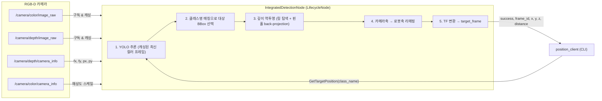

# ROS 2 + YOLO 기반 로봇팔 대상 3D 객체 위치추정 시스템

> RGB-D 카메라와 YOLO를 결합해, **클래스명(class name) 질의 한 번으로 대상 물체의 3D 좌표(x, y, z)를 로봇팔 프레임 기준으로 반환하는** ROS 2 서비스.


---

## 1. 프로젝트 개요

로봇팔로 물체를 다루려면 "무엇이 보이는가"(인식)와 "그것이 로봇 좌표계에서 어디인가"(3D 위치추정)가 모두 필요합니다. 일반적인 검출 파이프라인은 매 프레임 결과를 토픽으로 발행하지만, 이 프로젝트는 **필요한 시점에 특정 대상 하나의 좌표만 요청-응답으로 받는** 서비스 형태를 택했습니다.

- **입력**: RGB-D 카메라의 컬러 이미지, 깊이 이미지, 컬러/깊이 `CameraInfo`
- **질의**: 클라이언트가 대상 클래스명을 담아 `GetTargetPosition` 서비스를 호출
- **처리**: 요청 시점에 캐싱된 최신 컬러 프레임으로 YOLO 추론 1회 → 클래스명 매칭 → 깊이 역투영 → 카메라축→로봇축 리매핑 → TF 변환(`target_frame`, 기본 `arm_link`)
- **출력**: `success`, `frame_id`, `x`, `y`, `z`, `distance`

이 저장소가 담당하는 범위는 **인식과 3D 좌표 산출까지**입니다. 파지(grasp) 동작이나 모션 플래닝은 이 저장소에 포함되어 있지 않으며, 반환된 좌표를 사용하는 상위 제어기는 별도입니다.

---

## 2. 시스템 아키텍처

`IntegratedDetectionNode`는 네 개의 토픽을 구독해 최신 메시지를 보관하고 있다가, 서비스 요청이 들어오면 아래 파이프라인을 1회 실행합니다.



콜백은 메시지를 변수에 보관만 하고 연산을 하지 않으며, 추론은 서비스 요청 시점에만 수행됩니다.

upstream에서 상속한 상시 파이프라인(2D → 추적 → 3D → 디버그)의 노드 그래프는 아래와 같습니다.

| 2D 검출 파이프라인 | 3D 위치추정 파이프라인 |
| :---: | :---: |
|  |  |

---

## 3. 동작 원리

### 4.1 서비스 콜백 처리 순서

| 단계 | 처리 내용 |
| :--: | :-- |
| **0** | 응답을 `x = y = z = distance = 0.0`, `frame_id = ''`, `success = False`로 초기화 |
| **1** | `request.class_name`을 읽고 `.strip()`; 비어 있으면 경고 후 실패 반환 |
| **2** | 최신 컬러/깊이/깊이-info 메시지 존재 여부 확인, 없으면 실패 반환 |
| **3** | `cv_bridge`로 컬러 이미지 변환(`bgr8`) 후 `yolo.predict(...)` 1회 실행, `results[0].cpu()` |
| **4** | `_parse_detections`로 정렬(`xywh`)/회전(OBB, `xywhr`) 박스를 `Detection` 리스트로 변환; 비어 있으면 실패 반환 |
| **5** | `_norm_name`으로 정규화 후 정확 일치 탐색 → 없고 `match_substring=True`면 양방향 부분일치 탐색. 리스트에서 **처음 일치하는 항목**을 사용 |
| **6** | `_convert_bb_to_3d`로 박스 중심을 깊이 역투영; `None`이면 실패 반환 |
| **7** | `use_tf=True`면 `target_frame`으로 TF 변환. 변환 실패 시 깊이 카메라 프레임 좌표로 폴백 |
| **8** | `x`, `y`, `z`, `distance`, `frame_id`를 응답에 채우고 `success = True` |

전체 콜백은 `try/except`로 감싸져 있어 예외 발생 시 로그를 남기고 실패 응답을 반환합니다.

### 3.2 깊이 픽셀 탐색 (확장 링 스캔)

깊이 이미지에는 값이 0이거나 NaN인 픽셀이 존재할 수 있어, 박스 중심 한 점만 읽으면 값을 얻지 못할 수 있습니다. 이를 위해 중심에서 바깥으로 사각 링을 넓혀가며 첫 유효 픽셀을 찾습니다.

- `max_radius = min(depth_w/2, depth_h/2, 50)` — 박스 크기의 절반, 최대 50 px로 제한
- `radius = 0`이면 중심 픽셀을 검사
- `radius > 0`이면 해당 링의 경계 픽셀만 순회하고, 이미지 범위를 벗어나면 건너뜀
- `isfinite(depth) and depth > 0`인 첫 픽셀을 채택하고, 끝까지 없으면 경고 후 `None` 반환

> 코드 주석은 "스파이럴 탐색"으로 표기되어 있으나, 실제 구현은 나선이 아니라 체비쇼프(L∞) 거리 기준의 사각 링 스캔입니다.

### 3.3 핀홀 역투영

찾은 픽셀 `(u, v)`와 깊이 카메라 내부 파라미터 `k`로 3D 좌표를 계산합니다.

```
z      = z_raw / depth_image_units_divisor      # 기본 1000
fx, fy = k[0], k[4]
px, py = k[2], k[5]                             # fx 또는 fy가 0이면 경고 후 None
cam_x  = z * (u - px) / fx
cam_y  = z * (v - py) / fy
cam_z  = z
```

`distance`는 리매핑 후 좌표의 유클리드 노름 `‖[robot_x, robot_y, robot_z]‖`로 계산해 응답에 포함합니다.

### 3.4 카메라축 → 로봇축 리매핑

코드는 카메라 광학 좌표계 값을 다음과 같이 재배치합니다.

```
robot_x =  cam_z
robot_y =  cam_x
robot_z = -cam_y
```

### 3.5 컬러↔깊이 해상도 스케일링

추론은 컬러 프레임에서, 깊이 샘플링은 깊이 프레임에서 이뤄지므로 두 해상도가 다를 수 있습니다. `_get_color_to_depth_scale`은 **컬러 `CameraInfo`의 해상도**와 **깊이 이미지 배열(`depth_image.shape`)의 해상도**로 `(sx, sy) = (depth_w/color_w, depth_h/color_h)`를 계산합니다. 컬러 info가 없거나 두 해상도가 같으면 `(1.0, 1.0)`을 사용합니다.

### 3.6 TF 변환

`tf_buffer.lookup_transform(target_frame, frame_id, rclpy.time.Time())`로 변환을 조회한 뒤, 쿼터니언-벡터 회전을 직접 구현한 `qv_mult`로 좌표를 변환합니다.

```
qv_mult(q, v):
    uv  = cross(qvec, v)
    uuv = cross(qvec, uv)
    return v + 2 * (uv * q0 + uuv)

p_target = R(q) * p_source + t
```

`TransformException`이 발생하면 경고를 남기고 깊이 카메라 프레임 기준 좌표를 반환하므로, 클라이언트는 응답의 `frame_id`로 기준 프레임을 확인해야 합니다.

### 3.7 클래스명 정규화

`_norm_name`은 문자열을 소문자로 바꾸고 영숫자만 남깁니다(`isalnum`). 따라서 `Wooden Cube`, `wooden_cube`, `woodencube`는 동일하게 취급됩니다.

---

## 4. 기술 스택

| 분류 | 사용 기술 |
| :-- | :-- |
| 언어 | Python 3 |
| 로봇 미들웨어 | ROS 2, `rclpy`, `LifecycleNode` |
| 딥러닝 | Ultralytics YOLO `8.4.6`, PyTorch, CUDA (기본 `cuda:0`) |
| 컴퓨터 비전 | OpenCV (`opencv-python >= 4.8.1.78`), `cv_bridge` |
| 좌표 변환 | `tf2_ros` (`TransformListener`) |
| 인터페이스 | `yolo_msgs` (`.msg` / `.srv`) |
| 수치 연산 | NumPy (`<2`), `lap` |
| 빌드 / 배포 | `colcon` (ament_python / ament_cmake), Docker (multi-stage), GitHub Actions |

---

## 5. 프로젝트 구조

```
.
├── Dockerfile                    # 멀티스테이지(deps → builder), ROS_DISTRO 빌드 인자
├── requirements.txt              # ultralytics==8.4.6, numpy<2, opencv, lap
├── CITATION.cff                  # upstream 저작자 표기
├── LICENSE                       # GNU GPL v3
├── docs/                         # rqt 노드 그래프 이미지
├── yolo_msgs/                    # [ament_cmake] 인터페이스 정의 패키지
│   ├── msg/                      # 12개 메시지 (Detection, BoundingBox3D 등)
│   └── srv/
│       ├── GetTargetPosition.srv # 저자 추가: 클래스명 → 3D 좌표
│       └── SetClasses.srv        # YOLOWorld 클래스 재설정
├── yolo_ros/                     # [ament_python] 노드 패키지
│   ├── model/
│   │   ├── best.pt               # 저자 추가: yolo.launch.py의 기본 모델
│   │   └── wooden_cube.pt        # 저자 추가: obj_detection의 기본 모델
│   ├── yolo_ros/
│   │   ├── obj_detection.py      # 저자 추가: IntegratedDetectionNode
│   │   ├── position_client.py    # 저자 추가: CLI 클라이언트
│   │   ├── detect_3d_node.py     # 저자 수정: 상시 3D 파이프라인
│   │   ├── yolo_node.py          # upstream
│   │   ├── tracking_node.py      # upstream
│   │   └── debug_node.py         # upstream
│   └── setup.py                  # console_scripts 등록
└── yolo_bringup/                 # [ament_cmake] 런치 패키지
    └── launch/                   # yolo.launch.py + 모델별 래퍼 런치
```

`console_scripts`: `yolo_node`, `tracking_node`, `detect_3d_node`, `debug_node`, `obj_detection`, `position`

---

## 6. 설치 및 실행

### 6.1 Docker

```bash
docker pull jeongsj/object_detection

docker run -it --gpus all --net host yolo_ros
```

### 6.2 네이티브 빌드 (colcon)

```bash
mkdir -p ~/ros2_ws/src && cd ~/ros2_ws/src
git clone https://github.com/Roka-jsj/object_detection.git

cd ~/ros2_ws
rosdep install --from-paths src --ignore-src -r -y
pip3 install -r src/object_detection/requirements.txt

colcon build
source install/setup.bash
```

> `yolo.launch.py`의 `throttle` 노드는 `topic_tools` 패키지를 사용합니다. 해당 패키지가 설치되어 있지 않다면 `sudo apt install ros-$ROS_DISTRO-topic-tools`로 설치하십시오.

### 6.3 서비스 노드 + 클라이언트 실행

```bash
# 1) RGB-D 카메라 드라이버가 아래 토픽을 발행해야 합니다.
#    /camera/color/image_raw, /camera/depth/image_raw,
#    /camera/depth/camera_info, /camera/color/camera_info

# 2) 서비스 노드 실행
#    service_name 기본값이 get_target_position 이므로,
#    클라이언트가 찾는 /yolo/get_target_position 과 맞추려면 /yolo 네임스페이스로 실행합니다.
ros2 run yolo_ros obj_detection --ros-args \
  -r __ns:=/yolo \
  -p model:=/ros2_ws/src/yolo_ros/yolo_ros/model/wooden_cube.pt \
  -p target_frame:=arm_link

# 3) 좌표 요청
ros2 run yolo_ros position wooden_cube
```

### 6.4 상시 파이프라인 (bringup)

```bash
ros2 launch yolo_bringup yolov8.launch.py

ros2 service call /yolo/get_target_position \
  yolo_msgs/srv/GetTargetPosition "{class_name: 'wooden_cube'}"
```

### 6.5 `IntegratedDetectionNode` 파라미터

| 파라미터 | 기본값 | 설명 |
| :-- | :-- | :-- |
| `model_type` | `YOLO` | `YOLO` / `World` / `YOLOE` |
| `model` | `/ros2_ws/src/yolo_ros/yolo_ros/model/wooden_cube.pt` | 가중치 경로 |
| `device` | `cuda:0` | 추론 디바이스 |
| `yolo_encoding` | `bgr8` | `cv_bridge` 변환 인코딩 |
| `threshold` | `0.5` | 신뢰도(conf) |
| `iou` | `0.5` | NMS IoU |
| `imgsz_height` / `imgsz_width` | `640` / `640` | 추론 입력 크기 |
| `half` / `augment` / `agnostic_nms` / `fuse_model` | `False` | 추론 옵션 |
| `max_det` | `300` | 최대 검출 수 |
| `target_frame` | `arm_link` | TF 변환 대상 프레임 |
| `depth_image_units_divisor` | `1000` | 깊이 단위 변환 |
| `image_topic` | `/camera/color/image_raw` | 컬러 이미지 토픽 |
| `depth_image_topic` | `/camera/depth/image_raw` | 깊이 이미지 토픽 |
| `depth_info_topic` | `/camera/depth/camera_info` | 깊이 내부 파라미터 |
| `color_info_topic` | `/camera/color/camera_info` | 컬러→깊이 스케일 계산용 |
| `image_reliability` / `depth_image_reliability` / `depth_info_reliability` | `BEST_EFFORT` | 구독 QoS |
| `service_name` | `get_target_position` | 서비스명 |
| `match_substring` | `True` | 부분일치 매칭 허용 |
| `use_tf` | `True` | TF 변환 적용 여부 |

---

## 7. 서비스 & 메시지 API

### `yolo_msgs/srv/GetTargetPosition`

| 방향 | 필드 | 타입 | 설명 |
| :-- | :-- | :-- | :-- |
| Request | `class_name` | `string` | 조회할 대상 클래스명 |
| Response | `success` | `bool` | 성공 여부 |
| Response | `frame_id` | `string` | 좌표 기준 프레임 |
| Response | `x` / `y` / `z` | `float64` | 3D 좌표 (m) |
| Response | `distance` | `float64` | 원점으로부터의 거리 (m) |

### 주요 메시지 (`yolo_msgs/msg`)

`Point2D`/`Vector2`/`Pose2D` → `BoundingBox2D` → `Detection` → `DetectionArray` 순으로 합성됩니다.

| 메시지 | 주요 필드 |
| :-- | :-- |
| `Detection` | `class_id`, `class_name`, `score`, `id`, `bbox`, `bbox3d`, `mask`, `keypoints`, `keypoints3d` |
| `DetectionArray` | `header`, `Detection[] detections` |
| `BoundingBox2D` | `Pose2D center`, `Vector2 size` (픽셀) |
| `BoundingBox3D` | `geometry_msgs/Pose center`, `Vector3 size`, `frame_id`, `distance` (m) |
| `Mask` | `height`, `width`, `Point2D[] data` (경계 점 표현) |

---

## 8. 지원 YOLO 변형

`yolo.launch.py`를 파라미터화한 래퍼 런치들이 함께 제공됩니다.

| 런치 파일 | 기본 모델 |
| :-- | :-- |
| `yolov5.launch.py` | `yolov5mu.pt` |
| `yolov8.launch.py` | `yolov8m.pt` |
| `yolov9.launch.py` | `yolov9c.pt` |
| `yolov10.launch.py` | `yolov10m.pt` |
| `yolov11.launch.py` | `yolo11m.pt` |
| `yolov12.launch.py` | `yolo12m.pt` |
| `yolov26.launch.py` | `yolo26m.pt` |
| `yolo-world.launch.py` | `yolov8s-worldv2.pt` |
| `yoloe.launch.py` | `yoloe-11l-seg-pf.pt` |

- 정렬(`xywh`) 및 회전(OBB, `xywhr`) 박스 지원
- 추적: ByteTrack / BoT-SORT
- `use_tracking` / `use_3d` / `use_debug` 플래그로 파이프라인 구성 변경
